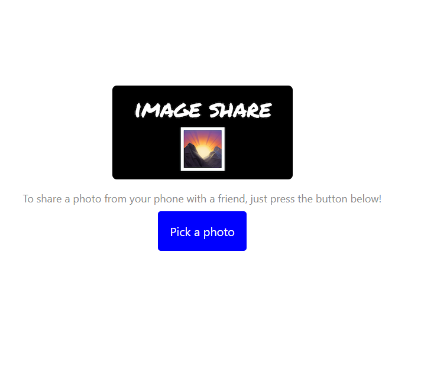
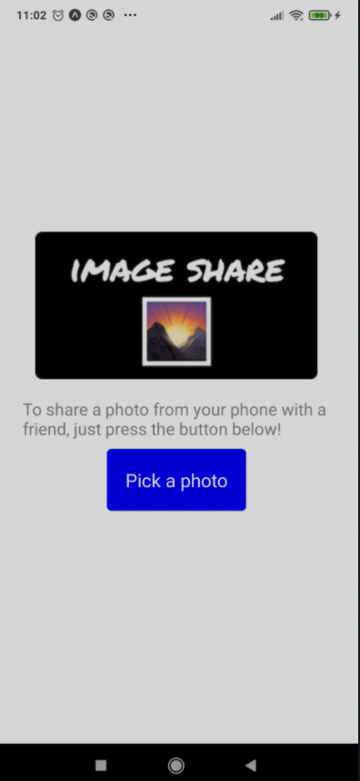

# Título del Proyecto

Trata de la realización de cursos de react y una Guia de los apartados mas interesantes que se me han ocurrido . Consta de 3 proyectos y una guia de react
## Comenzando 🚀

_Cada carpeta dentro del repositorio indica un proyecto en react_

### Proyecto 1 - Testimonios


### Proyecto 2 - Contador de Cicks


### Proyecto 3 - Lista de Tareas editables


### Proyecto 4 - ShareImages App (web)


### Proyecto 5 - ShareImages App (react Native Android App)



**Crear app** _ (llamada mi-app)_:
``` 
npx create-react-app mi-app 
```
**Star App**:
``` 
npm start
``` 

### Pre-requisitos 📋

_Puede realizar un npm install si fuese necesario_

```
 npm install 
```

## Ejecutando las pruebas ⚙️

Compiled successfully!

You can now view aplicacion-react-tareas in the browser.

  Local:            [http://localhost:3000](http://localhost:3000 "http://localhost:3000")
  On Your Network:  [http://192.168.56.1:3000](http://192.168.56.1:3000 "http://192.168.56.1:3000")

Note that the development build is not optimized.
To create a production build, use npm run build.
webpack compiled successfully
# Guia React

## Props
### Pasar atributos a los componentes:
Por ejemplo tenemos nuestros componentes Contador y Boton1/Boton2 ...  numClicks es un prop texto es otro prop 

```html
        <Contador numClicks={numClicks} />
        <Boton texto="Click" esBotonDeClick={true} manejarClick={manejarClick} />
        <Boton texto="Reiniciar" esBotonDeClick={false} manejarClick={reiniciarContador} />
```
### Recibir datos en componentes:
Partiendo del siguiente componente podemos obtener datos de los props como atributos de la funcion Boton que los pasamos como un objeto js {} o directamente accediendo al objeto js propsArg y llamando a su proiedad.
```js
        import React from 'react';
        import "../css/Boton.css"
        function Boton({ texto, esBotonDeClick, manejarClick }) {
        //function Boton(props) {   //  en caso  de obj js props
            return (
                <button
                    className={esBotonDeClick ? "boton-click" : "boton-reiniciar"}
                    //className={props.esBotonDeClick ? "boton-click" : "boton-reiniciar"} //  en caso  de obj js props
                    onClick={manejarClick}
                    //onClick={props.manejarClick} //  en caso  de obj js props
                    >
                    {texto}
                    //{props.texto} //  en caso  de obj js props
                </button>
            )
        }
        export default Boton;
```
## Hooks
Con los hooks puedes pasar variables dinamicas a los componentes de funcion mediante setters y props
es necesario : 
```js  
import { useState } from "react"

const [numClicks, setNumClicks] = useState(0); // 0 es el state inicial // la variable a usar es numClicks // el setter para editar esta variable es setNumClicks

const manejarClick = () => {
    setNumClicks(numClicks + 1);
}; //

const reiniciarContador = () => {
    setNumClicks(0);
}; //
```
### Pasar texto a los componentes mediante etiqueta de cierre 
    
```js    
<Boton>1</Boton>
```
Recibir estos datos en componente
```js    
return (
    <div>
        {props.children}
    </div>
);
```

### Se puede hacer clases dinamicas en react y css 
```js
className={`boton-contenedor ${esOperador(props.children) ? 'operador' : null}`}
```
Utilizamos ${} para llamar a una funcion y en caso true se adjunta la clase operador en caso false null. ** ( Operador ternario  ?) **
para ello se define en el componente la funcion a llamar.
```js
const esOperador = valor => {
    return isNaN(valor) && (valor != '.') && (valor != '=');
}
```

y cambiamos  
```js
import React from 'react';  // importante en este caso que sea mayuscula React
```

quedando el componente tal que asi:
```js
import React from 'react';

function Boton(props) {

    const esOperador = valor => {
        return isNaN(valor) && (valor != '.') && (valor != '=');
    }
    
    return (
        <div className={`boton-contenedor ${esOperador(props.children) ? 'operador' : ''}`.trimEnd()}> /*trimEnd borra espacios al final del string */
            {props.children}
        </div>
    );
}
export default Boton;
```

**se crean plantillas de css con  \`\`     =>  EJEMPLO: 
```js
`boton-contenedor ${esOperador(props.children) ? 'operador' : ''}`
```
en estas se pueden implementar con codigo js mediante {} con lo que llamamos a esOperador pasandole como atributos lo que hay entre las llaves

### Para componentes tipo flecha
 Para componentes sencillos se puede usar esta semantica con tipo flecha
```js
const Pantalla = ({ input }) => (
    <div className="input">
        {input}
    </div>
);
export default Pantalla; 
```

Hooks
```js
import { useState } from 'react' ; /necesario para crear estados 
```

En este caso creamos un estado que el valor se refleja en input y obtenemos una fucion setter llamada setInput, input en este caso se inicializa con valor = ''
```js
  const [input, setInput] = useState('');
```

Añadir un prop a un componente 
```js
          <Boton manejarClick={agregarInput} >1</Boton>
```

y desde este lo podemos llamar, si lo importamos como (props) props.manejarClick o si lo importamos {manejarClick} manejarClick

Manejar logica de un boton mediante onclick
```js
        <div 
        className={`boton-contenedor ${esOperador(props.children) ? 'operador' : ''}`.trimEnd()}
        onClick={() => props.manejarClick(props.children)}  // aqui le decimos que onClick llame a una funcion de js anonima que recibe de props y se llama 
        //manejarClick pasandole de parametro lo que haya dentro de props.children que es lo que hay dentro de la instancia del objeto
        > 
            {props.children}
        </div>
```

Fragmentos para no poner un contenedor que no tiene proposito se pueden usar etiquetas en blanco como...
```js
        function ListaDeTareas(){
            return(
                <>

                </>
            )
        }
```

A la hora de representar en una lista es necesario indicar con key el orden y que este valor sea unico. este valor no es pasado como props
si lo quieres como prop hay que pasarlo duplicado con otro nombre id en este caso ... key es totalmente necesario

```js
     <div className="tareas-lista-contenedor">
        {
            tareas.map((tarea)=>
                <Tarea
                key={tarea.id}
                id={tarea.id}
                texto={tarea.texto}
                completada={tarea.completada}
                />
            )
        }
            </div>
```

### Los componentes de clase 
En el constructor llaman a super si tiene props tambien los recibe constructor(props) y super(props)
```js
class Tarea extends React.Component{
    constructor(props){
    super(props);
}
render(){
    return <p>Mi Tarea  </p>;
    }
}
```

### El estado :
el objeto state se inicializa en el constructor para manejar los estaddos en el objeto js state

```js
    class Tarea extends React.Component{
        constructor(props){
            super(props);
            this.state = {
                completada:true,
                color:red,
                prioridad:1
        }
        render(){
            return <p>Mi Tarea  </p>;
        }
    }
```

####  Acceder al estado 
Mediante this.state.NombrePropiedad
```js
     this.state = {
                completada:true,         // this.state.completada ... Para acceder a ellas
                color:red,               // this.state.color
                prioridad:1              // this.state.prioridad
        }
```
Por ejemplo:
```js
render(){
    return <p>Mi Tarea es de color {this.state.color}  </p>;
}
```
#### Actualizar el estado 
Mediante this.setState({ SOLO PROPIEDADES A CAMBIAR LAS OTRAS NO SE VEN AFECTADAS}) 
```js
this.setState({
    completada:false,
    color:"green"  //  prioridad no cambiar => ( prioridad:1 )
});
```
Metodos de ciclos de vida son metodos especiales de React usados para realizar 
operaciones con componentes en momentos específicos de la vida del componente en el DOM (cuando se crean, editan...)

## React Native (Conversion)

Pasos a seguir
Para convertir una app de React de web en una aplicación de React Native tienes que seguir los siguientes pasos:

  1. Crear una aplicación de React Native desde cero. Para eso hay que ejecutar los comandos como «npx react-native init SampleProject» o para un proyecto de                Typescript «npx react-native init SampleProject –template react-native-template-typescript«
  2. Quitar los ficheros css de todos los archivos. Tienes que eliminar todos los import ‘simple.css’ o require (‘simple.css’) en todos los ficheros. React Native          utiliza otro sistema de estilos.
  3.  Convertir los componentes de React en los componentes de React Native. React Native usa sus propios componentes y tenemos que cambiar los componentes de DOM a         los componentes de React Native.
  4. Crear los estilos para componentes. Tienes que crear los objetos StyleSheet que se utiliza en el mundo de React Native para estilizar las vistas.
```js
const styles = StyleSheet.create({
  container: {
    flex: 1,
    padding: 24,
    backgroundColor: "#eaeaea"
  },
  title: {
    marginTop: 16,
    paddingVertical: 8,
    borderWidth: 4,
    borderColor: "#20232a",
    borderRadius: 6,
    backgroundColor: "#61dafb",
    color: "#20232a",
    textAlign: "center",
    fontSize: 30,
    fontWeight: "bold"
  }
});

const styles = StyleSheet.create({
  container: {
    flex: 1,
    padding: 24,
    backgroundColor: "#eaeaea"
  },
  title: {
    marginTop: 16,
    paddingVertical: 8,
    borderWidth: 4,
    borderColor: "#20232a",
    borderRadius: 6,
    backgroundColor: "#61dafb",
    color: "#20232a",
    textAlign: "center",
    fontSize: 30,
    fontWeight: "bold"
  }
});
```
  5. Cambiar las librerías de navegación a las de React Native. Existe la versión de React Router para React Native: React Router Native. También existen las librerías      React Navigation y React Native Navigation.

Si el código de React utiliza de alguna forma la API de Node.JS (fs,os,Path etc) o utiliza los objetos como window() o history(), hay que cambiar el código según el contexto para utilizar la API de React Native.
## React Native Expo Lib
    Installing Expo CLI
```
npm install --global expo-cli
```
Initializing the project
```
expo init my-app-native && cd my-app-native
```
Starting the development server
```
expo start
```
Obtendremos un template vacío. Empezamos a tocar... Nos encontramos esto y cambiamos el Text para añadir un estilo y comprobar que es distinto al css convencional
```js
import React from 'react';
import { StyleSheet, Text, View } from 'react-native';
export default function App() {
  return (
    <View style={styles.container}>
      <Text style={{color: '#888', fontSize: 18}}>  //ver css
        To share a photo from your phone with a friend, just press the button below!
      </Text>
    </View>
  );
}
const styles = StyleSheet.create({
  container: {
    flex: 1,
    backgroundColor: '#fff',
    alignItems: 'center',
    justifyContent: 'center',
  },
});
```
Añadimos una imagen importando su source, su tipo de variable de react 

```js
import { Image,  StyleSheet, Text, View } from 'react-native';
import logo from './assets/logo.png'; 
export default function App() {
  return (
    <View style={styles.container}>
      <Image source={logo} style={{ width: 305, height: 159 }} />  //aqui está
      <Image source={{ uri: "https://i.imgur.com/TkIrScD.png" }} style={{ width: 305, height: 159 }} /> // mediante url
      <Text style={{color: '#888', fontSize: 18}}> 
        To share a photo from your phone with a friend, just press the button below!
      </Text>
    </View>
  );
}
```
Organizamos bien el style:
```js
export default function App() {
  return (
    <View style={styles.container}>
      <Image source={{ uri: "https://i.imgur.com/TkIrScD.png" }} style={styles.logo} />
      <Text style={styles.instructions} >
        To share a photo from your phone with a friend, just press the button below!
      </Text>
    </View>
  );
}
const styles = StyleSheet.create({
  container: {
    flex: 1,
    backgroundColor: '#fff',
    alignItems: 'center',
    justifyContent: 'center',
  },
  logo: {
    width: 305,
    height: 159,
    marginBottom: 10,
  },
  instructions: {
    color: '#888',
    fontSize: 18,
    marginHorizontal: 15,
  }, 
});
```
Creando un Boton
```js
import { Image, StyleSheet, Text, TouchableOpacity, View } from 'react-native';
export default function App() {
  return (
    <View style={styles.container}>
      <Image source={{ uri: 'https://i.imgur.com/TkIrScD.png' }} style={styles.logo} />
      <Text style={styles.instructions}>
        To share a photo from your phone with a friend, just press the button below!
      </Text>
// BUTTON ==
      <TouchableOpacity onPress={() => alert('Hello, world!')} style={styles.button}>
        <Text style={styles.buttonText}>Pick a photo</Text>
      </TouchableOpacity>
    </View>
  )}
const styles = StyleSheet.create({
  container: {
    flex: 1,
    backgroundColor: '#fff',
    alignItems: 'center',
    justifyContent: 'center',
  },
  logo: {
    width: 305,
    height: 159,
    marginBottom: 10,
  },
  instructions: {
    color: '#888',
    fontSize: 18,
    marginHorizontal: 15,
  }, 
  button: {
    backgroundColor: "blue",
    padding: 20,
    borderRadius: 5,
  },
  buttonText: {
    fontSize: 20,
    color: '#fff',
  }, 
});
  );
}
```
Picking an image
Primero necesitamos cargar este modulo con:
```bash
 expo install expo-image-picker
```
```js
import React from 'react';
import { Image, StyleSheet, Text, TouchableOpacity, View } from 'react-native';
import * as ImagePicker from 'expo-image-picker'; //importamos
export default function App() {
     //Abrir imagenes asincrono
  let openImagePickerAsync = async () => {
    let permissionResult = await ImagePicker.requestMediaLibraryPermissionsAsync();
     //Pedir Permisos
    if (permissionResult.granted === false) {
      alert("Permission to access camera roll is required!");
      return;
    }
     //Recoger el resultado
    let pickerResult = await ImagePicker.launchImageLibraryAsync();
    console.log(pickerResult);
  }
  
  return (
    <View style={styles.container}>
      <Image source={{ uri: 'https://i.imgur.com/TkIrScD.png' }} style={styles.logo} />
      <Text style={styles.instructions}>
        To share a photo from your phone with a friend, just press the button below!
      </Text>
      <TouchableOpacity onPress={openImagePickerAsync} style={styles.button}>
        <Text style={styles.buttonText}>Pick a photo</Text>
      </TouchableOpacity>
    </View>
  );
}
```
Interactuando con la imagen seleccionada:
```js

import React from 'react';
import { Image, StyleSheet, Text, TouchableOpacity, View } from 'react-native';
import * as ImagePicker from 'expo-image-picker';
export default function App() {
  let [selectedImage, setSelectedImage] = React.useState(null);
  let openImagePickerAsync = async () => {
    let permissionResult = await ImagePicker.requestCameraRollPermissionsAsync();
    if (permissionResult.granted === false) {
      alert('Permission to access camera roll is required!');
      return;
    }
    let pickerResult = await ImagePicker.launchImageLibraryAsync();
    if (pickerResult.cancelled === true) {
      return;
    }
    setSelectedImage({ localUri: pickerResult.uri });
  };
  if (selectedImage !== null) { //devolvemos la imagen en una nueva vista si la imagen no es null
    return (
      <View style={styles.container}>
        <Image source={{ uri: selectedImage.localUri }} style={styles.thumbnail} />
      </View>
    );
  }
  return (
       <View style={styles.container}>
      <Image source={{ uri: 'https://i.imgur.com/TkIrScD.png' }} style={styles.logo} />
      <Text style={styles.instructions}>
        To share a photo from your phone with a friend, just press the button below!
      </Text>
      <TouchableOpacity onPress={openImagePickerAsync} style={styles.button}>
        <Text style={styles.buttonText}>Pick a photo</Text>
      </TouchableOpacity>
    </View>
  );
}
const styles = StyleSheet.create({
  container: {
    flex: 1,
    backgroundColor: '#fff',
    alignItems: 'center',
    justifyContent: 'center',
  },
  logo: {
    width: 305,
    height: 159,
    marginBottom: 20,
  },
  instructions: {
    color: '#888',
    fontSize: 18,
    marginHorizontal: 15,
    marginBottom: 10,
  },
  button: {
    backgroundColor: 'blue',
    padding: 20,
    borderRadius: 5,
  },
  buttonText: {
    fontSize: 20,
    color: '#fff',
  },
  thumbnail: {
       width: 300,
    height: 300,
    resizeMode: 'contain',
  },
});
```
Para compartir la imagen :
 será necesario instalar 
 ```
 expo install expo-sharing
 ```
```js
import * as Sharing from 'expo-sharing'; 
// con esta funcion llamamos a compartir
  let openShareDialogAsync = async () => {
    if (Platform.OS === 'web') {
      alert(`Uh oh, sharing isn't available on your platform`);
      return;
    }
    await Sharing.shareAsync(selectedImage.localUri);
  }; 
// con esta funcion devolvemos la vista de compartir
  if (selectedImage !== null) {
    return (
      <View style={styles.container}>
        <Image source={{ uri: selectedImage.localUri }} style={styles.thumbnail} />
        <TouchableOpacity onPress={openShareDialogAsync} style={styles.button}>
          <Text style={styles.buttonText}>Share this photo</Text>
        </TouchableOpacity>
        </View>
    );
  }
...
```
Configurar pantalla de inicio como splas.png buscar este archivo en assets y sustituir cambiar el color en 
 app.json desde el directorio de su proyecto en su editor de código y realice el siguiente cambio en la splashsección:
 ```js
  "splash": {
  "image": "./assets/splash.png",
  "resizeMode": "contain",
  "backgroundColor": "#000000"
},
```
## Construido con 🛠️


* [Youtube Course](https://www.youtube.com/watch?v=6Jfk8ic3KVk&ab_channel=freeCodeCampEspa%C3%B1ol
) - Curso realizado
* [React](https://reactjs.org/) - Framework

## Versionado 📌

V1.0 de cada proyecto realizado con componentes de funcion.
V2.0 de cada proyecto realizado con componentes de clase.


## Autores ✒️

_Menciona a todos aquellos que ayudaron a levantar el proyecto desde sus inicios_

* **Daniel Burruchaga** -  [proyectos](https://github.com/danielei9)

## Licencia 📄
Este proyecto está bajo la Licencia MIT

